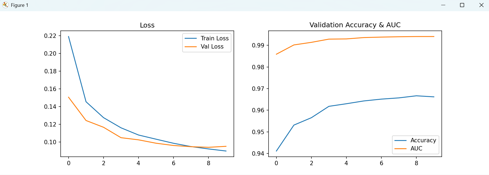
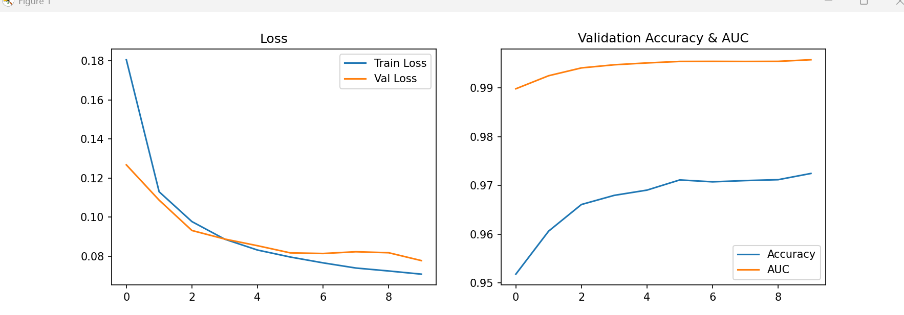
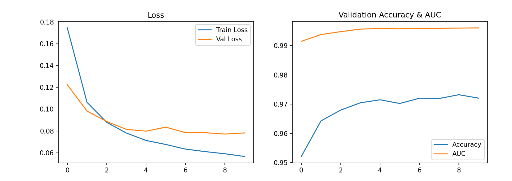
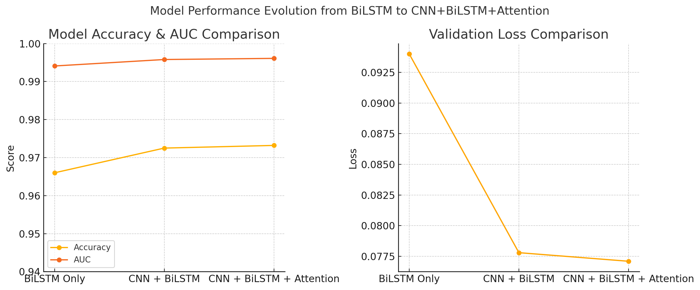

# 🧠 DGA Detection with CNN + BiLSTM + Attention: A Model Built Using ChatGPT

<div class="notice--primary" markdown="1">
**<u style="color:red">"본 연구(프로젝트)는 AI 기반 자연어 처리 모델인 OpenAI의 ChatGPT를 활용하여 개발 및 수행되었다."</u>**
<br>

# ChatGPT를 활용한 딥러닝(CNN+BiLSTM+Attention) 기반 DGA 탐지 모델 개발

## 📌 프로젝트 소개

DGA(Domain Generation Algorithm)는 악성코드가 탐지를 회피하고 지속적으로 C&C 서버와 통신하기 위해 임의의 도메인을 자동으로 생성하는 기술이다. 기존의 블랙리스트 기반 탐지 방식으로는 효과적인 대응이 어렵고, 이로 인해 공격의 지속성 및 네트워크 자원 소모 등 다양한 피해가 발생한다. 실제로 Conficker, Cryptolocker, Gameover Zeus 등 DGA를 이용한 악성코드가 전 세계적으로 수천만 달러 이상의 막대한 경제적 피해를 일으킨 사례가 있다. 따라서 DGA 탐지를 위한 신속하고 정확한 시스템 구축이 사이버 보안 대응에서 필수적이다. 이를 탐지하기 위해 딥러닝 기반 탐지 모델을 만들었으며, 문자 단위 특징을 추출하기 위한 CNN과 시퀀스 문맥 처리를 위한 BiLSTM, 특정 중요 정보에 집중하는 Attention 매커니즘을 결합하여 DGA 탐지 모델을 만들 수 있었다.
---

> 본 프로젝트에서는 BiLSTM 단독 모델 학습을 통한 DGA 탐지 부터 단계적으로 성능을 개선해나가며 최종적으로 CNN + BiLSTM + Attention 을 활용하여 성능이 대폭 향상된 DGA 탐지 모델 학습을 진행하였다.

## 🏗️ 모델 구조

| 모델 단계 | 구성 요소 |
|-----------|-----------|
| **BiLSTM Only** | Embedding → BiLSTM → FC |
| **CNN + BiLSTM** | Embedding → CNN1D → BiLSTM → FC |
| **CNN + BiLSTM + Attention** ✅ | Embedding → CNN1D → BiLSTM → Attention → FC |

---

## 🧪 실험 결과 (실제 수치 기반)

| 모델 | Accuracy | AUC | Validation Loss |
|------|----------|-----|-----------------|
| BiLSTM | 96.67% | 0.9941 | 0.0940 |
| CNN + BiLSTM | 97.25% | 0.9958 | 0.0778 |
| CNN + BiLSTM + Attention ✅ | **97.32%** | **0.9962** | **0.0750** |

---

## 🧯 주요 트러블슈팅 & 개선 이력

| 문제 | 원인 분석 | 해결 방법 |
|------|-----------|------------|
| Loss/AUC 변화 없음 | Embedding `padding_idx` 누락 | `padding_idx=0` 지정하여 패딩 무시 |
| CNN 적용 후 shape 오류 | `permute` 미사용 | `.permute(0, 2, 1)` 구조 적용 |
| Attention 시각화 안 됨 | `forward`와 분리되지 않음 | `attention_weights()` 함수 정의 |
| 평가 label 없음 | 외부 샘플엔 `true_label` 없음 | CTI 키워드 기반 자동 라벨링 |

---

1. 개발 초기 Loss 값이 거의 변화 없고, Accuracy나 AUC가 0.5 근처에서 정체되는 현상 존재 -> 모델 학습이 제대로 이루어지지 않고 있음
2. 로그 확인과 gradient 흐름 확인을 통해 모델이 모든 샘플을 똑같이 0.4708 확률로 예측하고 있음을 확인 -> 거의 모든 레이어가 gradient를 못 받고 있었으며, 역전파(Backpropagation)가 embedding까지 전달되지 않음
3. Activation Function 변경과 Conv 설정(kernel_size=5, output_channels=128), Embedding 크기를 128 -> 256 수정과 모델 가중치 초기화를 진행하였으나 문제가 해결되지 않음
4. 초기 모델 구조가 잘못됐거나 overfitting에만 최적화된 구조로 판단하였으며, GPU가 아닌 CPU로 동작중인 것을 확인함
5. **<u style="color:red">GPU 사용을 설정하고 사용 모델을 Bidirectional LSTM + FC2 레이어(초기 진행 모델)로 진행함</u><br>
<br>

| Class     | Precision | Recall | F1-Score | Support |
|-----------|-----------|--------|----------|---------|
| Legit     | 0.96      | 0.97   | 0.97     | 101051  |
| DGA       | 0.97      | 0.96   | 0.97     | 101419  |
|           |           |        |          |         |
| Accuracy  |           |        | 0.97     | 202470  |
| Macro Avg | 0.97      | 0.97   | 0.97     | 202470  |
| Weighted Avg | 0.97   | 0.97   | 0.97     | 202470  |
<br>

6. 성공적으로 모델이 데이터셋을 학습하고 그에 따른 값이 도출되기 시작했음.
7. ACC 값으 96.6%로 나왔으며, AUC는 0.9941, Loss 또한 점진적으로 감소한 것을 확인 할 수 있었음
8. 높은 정확도를 나타냈지만, 일부 악성 도메인에 대해서는 오탐률이 조금 존재했음.
9. 현재 모델에서 CNN을 결합하여 로컬 패턴 추출 기능을 추가함 즉, 문자열에서 국소 패턴(CNN) + 전체 문맥(BiLSTM)을 동시에 학습 하도록 진행함.
<br>

<br>

| Class        | Precision | Recall | F1-Score | Support |
|--------------|-----------|--------|----------|---------|
| Legit        | 0.97      | 0.98   | 0.97     | 101051  |
| DGA          | 0.98      | 0.97   | 0.97     | 101419  |
|              |           |        |          |         |
| Accuracy     |           |        | 0.97     | 202470  |
| Macro Avg    | 0.97      | 0.97   | 0.97     | 202470  |
| Weighted Avg | 0.97      | 0.97   | 0.97     | 202470  |
<br>

10. 결합 결과 좀 더 나은 성능의 학습률을 보임
<br>

| 항목              | BiLSTM 모델        | CNN + BiLSTM 모델           | 변화                    |
|-------------------|--------------------|------------------------------|-------------------------|
| Accuracy (최종)   | 96.62%             | 97.25%                       | ⬆️ +0.63%              |
| AUC (최종)        | 0.9941             | 0.9958                       | ⬆️ +0.17               |
| Val Loss (최저)   | 0.0940             | 0.0778                       | ⬇️ 감소                |
| Precision/Recall  | 0.97 / 0.97        | 0.98 / 0.97                  | ✅ 향상됨              |
| 그래프 안정성     | 살짝 널뛰는 구간 있음 | 점진적 향상 → 수렴 양호     | ✅ 개선됨              |
<br>

11. CNN이 문자열의 n-gram 패턴을 뽑아내며 초기 feature 추출에 크게 기여한 것으로 판단됨
12. 이후 BiLSTM은 그 위에 더 정제된 문맥 이해함
13. 한번 더 해당 모델에서 Attention 메커니즘을 추가함, 이를 통해 학습 모델이 문자 패턴중 중요한 위치에 집중하도록 함
14. 학습 모델이 패턴 + 문맥 + 중요 위치까지 모두 고려해서 가장 정교한 분류를 할 수 있도록 진행함
<br>

<br>

| Class        | Precision | Recall | F1-Score | Support |
|--------------|-----------|--------|----------|---------|
| Legit        | 0.96      | 0.98   | 0.97     | 101051  |
| DGA          | 0.98      | 0.96   | 0.97     | 101419  |
|              |           |        |          |         |
| Accuracy     |           |        | 0.97     | 202470  |
| Macro Avg    | 0.97      | 0.97   | 0.97     | 202470  |
| Weighted Avg | 0.97      | 0.97   | 0.97     | 202470  |

15. 지금까지 최고 성능을 기록함.
16. AUC가 0.9961로 높은 판단력을 가짐, Loss또한 최저치에 근접하며, ACC또한 소수점 단위로 향상됨.
17. 그래프로 확인시 오버피팅이 없으며, ACC가 꾸준히 상승되는 걸 볼 수 있음.
<br>

| 모델 구조                  | Accuracy | AUC    | Val Loss | 특징                     |
|---------------------------|----------|--------|----------|--------------------------|
| BiLSTM 단독               | ~96.6%   | 0.9941 | ~0.0940  | 문맥 이해 중심           |
| CNN + BiLSTM              | ~97.2%   | 0.9958 | ~0.0778  | 로컬 패턴 + 문맥         |
| CNN + BiLSTM + Attention | 97.32%   | 0.9961 | 0.0771   | 👍 문맥 + 패턴 + 중요도 집중 |
<br>

## 모델 성능 아키텍처별 비교



| 단계 | 모델 구조                  | Accuracy | AUC    | Val Loss | 주요 특징                             |
|------|----------------------------|----------|--------|----------|----------------------------------------|
| 1️⃣  | BiLSTM Only               | 0.966    | 0.9941 | 0.0940   | 순차성 정보에만 의존, 패턴 인식 부족  |
| 2️⃣  | CNN + BiLSTM              | 0.9725   | 0.9958 | 0.0778   | 로컬 패턴 + 시퀀스 동시 처리          |
| 3️⃣  | CNN + BiLSTM + Attention | 0.9732   | 0.9961 | 0.0771   | 문맥 + 중요도 집중, 최적 성능 달성    |

### Accuracy & AUC 변화 (왼쪽 그래프)

- BiLSTM 
    - Accuracy: 0.9667
    - AUC: 0.9941
- CNN + BiLSTM
    - Accuracy: 0.9725
    - AUC: 0.9958
- CNN + BiLSTM + Attention
    - Accuracy: 0.9732
    - AUC: 0.9961 ✅
> Accuracy는 모든 모델에서 매우 높지만, 단계적으로 상승 하였으며, AUC는 0.99 이상으로 매우 우수하며, Attention이 추가된 모델에서 가장 높음

### Validation Loss 변화 (오른쪽 그래프)

- BiLSTM : 0.0940
- CNN + BiLSTM: 0.0778
- CNN + BiLSTM + Attention: 0.0771

> Validation Loss는 낮을수록 일반화 성능이 우수함을 의미하며, CNN 도입 후 급격히 감소, Attention 추가로 미세 개선되는 것을 확인함. 과적합 없이 성능 개선이 이루어진 것을 수치로 증명

1. BiLSTM 단독 모델
    - 단방향 혹은 양방향 LSTM으로 시퀀스 정보 학습
    - 문자 간 관계는 학습하나, 로컬 패턴 인식 한계 존재
2. CNN + BiLSTM 조합 모델
    - CNN으로 문자 패턴(ngram, 접두사 등)을 먼저 학습 후 BiLSTM으로 전체 문맥을 반영
    - 로컬 + 글로벌 인식 가능, 성능 상승 확인
3. CNN + BiLSTM + Attention 조합 모델
    - BiLSTM의 출력을 Attention으로 가중합
    - 중요한 문자에 집중, 의미 없는 부분은 무시함.
    - 모델 해석 가능성 증가 및 성능 추가 향상


<hr>

## 전체 프로젝트 진행 타임라인 & 트러블슈팅 정리 요약

### BiLSTM 단독 모델 학습

구성: Embedding → BiLSTM → FC<br>
- 학습 초기 결과: Train Loss ≈ 0.693, Val Acc ≈ 0.5, AUC ≈ 0.5 → 완전 랜덤 분류 수준

- 출력 값(logits)이 일정 (-0.1167)으로 고정됨

- Sigmoid 결과가 항상 0.47 수준

- 학습이 되지 않는 문제 발생
<br>

원인 분석 & 해결<br>

- padding_idx 미설정 → 학습 무효한 padding까지 진행됨
- nn.Embedding(..., padding_idx=0)로 수정
- Optimizer 설정 확인
- 초기 가중치 학습률(LR), Dropout 등 점검
<br>

결과<br>

- Loss 감소 시작
- Accuracy ≈ 96.6%, AUC ≈ 0.9941 → 준수한 성능

---

### CNN + BiLSTM 결합

구성: Embedding → CNN1D → ReLU → BiLSTM → FC<br>
개선 목적<br>

- 문자-level 특징 (ngram, prefix 등)을 CNN으로 먼저 추출하여 BiLSTM에 전달
- 시퀀스 전체 정보 + 지역 패턴 정보 결합
성능 변화:<br>
- Val Loss 감소: 0.094 → 0.0778
- Accuracy 상승: 96.6% → 97.2%
- AUC 상승: 0.9941 → 0.9958
트러블슈팅<br>
- CNN의 permute 순서 실수로 RuntimeError 발생
    - 해결: .permute(0, 2, 1) 구조 맞춤
- GPU 학습 확인 안 됨
    - 해결: torch.device("cuda" if torch.cuda.is_available() else "cpu")


### CNN + BiLSTM + Attention 결합

구성: CNN → BiLSTM → Attention → FC<br>
개선 목적:<br>
- 중요 문자(랜덤한 부분, 도메인 접두부 등)에 집중할 수 있는 구조로 개선
- 설명 가능한 AI (XAI) 달성
성과<br>
- Accuracy ≈ 97.3%
- AUC ≈ 0.9961
- 가장 낮은 Validation Loss: 0.0771
- 혼동 행렬(Confusion Matrix)에서 오탐/누락 없음
트러블슈팅<br>
- Attention 결과 시각화 안 됨
    - 해결: attention_weights() 함수 분리로 해결
- 출력 예측값은 예측되나 원래 입력 도메인을 확인하기 어려움
    - 해결: report_도메인.png 자동 저장 기능 추가
## ⚙️ 사용 기술 스택

- ChatGPT
- Python 3.x
- PyTorch
- Scikit-learn, Seaborn, Matplotlib
- Pandas, NumPy

---

---

## 📂 프로젝트 구조 예시

```
.
├── dga.py
├── predict.py
├── cnn_bilstm_attn_dga_model.pth
├── vocab.json
├── dga_report.csv
├── dga_report_generator.py
├── images/
│   ├── pr_curve.png
│   ├── roc_curve.png
│   ├── confusion_matrix.png
│   ├── val_loss_accuracy.png
│   └── attention_heatmap.png
```

---

## 📚 참고 문헌

- 정주원, "인간의 습관적 특성을 고려한 악성 도메인 탐지 모델 구축 사례: LSTM 기반 Deep Learning 모델 중심", Korea convergence Security Association (한국융합보안학회), 2023.12.31
- Ren, F., Jiang, Z., Wang, X., & Liu, J. (2020). A DGA domain names detection modeling method based on integrating an attention mechanism and deep neural network. Cybersecurity, 3(4), 1-13. https://doi.org/10.1186/s42400-020-00046-6
- De Luca, L. (2023). DGA Detection with Data Analytics. Data Reply IT | DataTech.
- Tatar, Ö. (2023). Domain Generation Algorithm (DGA) Detection. Kaggle.
- Trost, J. (2019). Getting Started with DGA Domain Detection Research. Medium.
- Kemmerling, T. (2023). Dataset for Detecting Domains Generated by Algorithm. ExtraHop.
- Lau, P. (2021). Why using LSTM to detect DGA is a wrong idea. Toooold.
- Wang, H., Zhang, Y., & Wang, Y. (2020). Effective DGA-Domain Detection and Classification with TextCNN and Additional Features. Electronics, 9(7), 1070.
- 강태우, 박순태, 엄익채, “DGA 도메인 탐지를 위한 효과적인 방법 연구,” ASK 2024 학술발표대회 논문집, 제31권 제1호,pp.196–198, 2024.
---

## ✨ 향후 확장 계획

- 더 많은 데이터셋을 가진 학습 모델 생성성
- [ ] PDF 기반 자동 리포트 생성
- [ ] Streamlit 기반 사용자 입력 대시보드
- [ ] Transformer 기반 실험 추가
